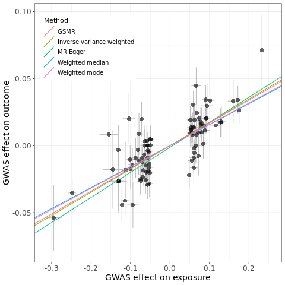

# LDSC_MR_Nextflow
This repository contains a NextFlow pipeline for performing heritability estimation, genetic correlation, and genetic causality analysis using GWAS data. 

It provides main result of this [Paper](https://pubmed.ncbi.nlm.nih.gov/34999863/). More details of each module can be found at [here](https://zhanghaoyang0.uk/#ldsc).

---
# Dependencies 
- `Linux`
- `Nextflow 24.10.3`
- `Plink 1.9`
- `Mamba` (or `Conda`)
- Conda Environment: 
  - `ldsc` - [LDSC GitHub](https://github.com/bulik/ldsc)
  - `r421_mr` - R 4.2.1 with the following packages: `TwoSampleMR`, `gsmr`, `dplyr`, `ggplot2`, `ggsci`

---
# Repository Structure

| **File**             | **Description**                                       |
|----------------------|-------------------------------------------------------|
| `data/trait1.txt.gz`      | T2D GWAS from Biobank Japan         |
| `data/trait2.txt.gz`      | Cataract GWAS from Biobank Japan                      |
| `reference_genome/1000g_bfile_hg19/`      | Reference genome (bfile)             |
| `reference_genome/1000g_ldscore_hg19/`    | LD scores files  |
| `reference_genome/w_hm3.snplist`          | HapMap 3 SNP list    |
| `munge/`          | will stores the processed GWAS    |
| `result/`          | will stores the outputs of the pipeline  |
| `clump/`          | will stores the results of LD clump  |
| `MR.r`          | R script for Mendelian Randomization |
| `main.nf`          | Next flow main script  |
| `nextflow.config`          | Next flow configuartion  |
| `README.md`          | README |

Structure tree:
```bash
├── data/
│   ├── trait1.txt.gz      # T2D GWAS from Biobank Japan (filtered to HM3)
│   └── trait2.txt.gz      # Cataract GWAS from Biobank Japan (filtered to HM3)
├── reference_genome/
│   ├── 1000g_bfile_hg19   # Reference genome files
│   ├── 1000g_ldscore_hg19 # LD score files
│   └── w_hm3.snplist      # HapMap 3 SNP list
├── main.nf
├── MR.r
├── munge/                 # Munged GWAS data
├── clump/                 # LD Clump result
├── nextflow.config
├── README.md
└── result/                # Output results for heritability, correlation, and causality

```


# Getting Started
Clone this repository via the commands:
```  
git clone https://github.com/zhanghaoyang0/LDSC_MR_Nextflow.git
cd LDSC_MR_Nextflow
```

Download the data and reference genome (Bash):
```bash  
wget -c https://zhanghaoyang0.uk/demo/ldsc/trait1.txt.gz -P data # T2D GWAS from Biobank Japan (filtered to HM3)
wget -c https://zhanghaoyang0.uk/demo/ldsc/trait2.txt.gz -P data # Cataract GWAS from Biobank Japan (filtered to HM3)
wget -c https://zhanghaoyang0.uk/db/1000g_bfile_hg19.tar.gz -P reference_genome # bfile
wget -c https://zhanghaoyang0.uk/db/1000g_ldscore_hg19.tar.gz -P reference_genome # ldscore
wget -c https://zhanghaoyang0.uk/db/w_hm3.snplist -P reference_genome # snp list for munge
tar -xvf reference_genome/1000g_bfile_hg19.tar.gz -C reference_genome
tar -xvf reference_genome/1000g_ldscore_hg19.tar.gz -C reference_genome
```

Set up `LDSC` conda environment (Bash):
```bash
git clone https://github.com/bulik/ldsc.git
conda env create --file ldsc/environment.yml
```

Set up `r421_mr` conda environment (Bash):
```bash
mamba create -n r421_mr r-base=4.2.1 r-dplyr r-ggplot2 r-ggsci  r-survey -c conda-forge
conda activate r421_mr
```

Install two R packages in `r421_mr` (R):
```r
devtools::install_github("MRCIEU/TwoSampleMR")
devtools::install_github("jianyanglab/gsmr2")
```

# Getting Started
Run `main.nf` (Bash):
```bash
nextflow run main.nf -with-conda
```

Once the above has completed, you will see:
```bash
 N E X T F L O W   ~  version 24.10.3

Launching `main.nf` [evil_kilby] DSL2 - revision: 4b6b30d85a

executor >  local (8)
[56/2ccd10] process > MungeGWAS (1)      [100%] 2 of 2 ✔
[bc/e419b3] process > Heritability (2)   [100%] 2 of 2 ✔
[2f/367ff9] process > GeneticCorrelation [100%] 1 of 1 ✔
[ab/291748] process > Clump              [100%] 1 of 1 ✔
[68/548abf] process > LD_Matrix          [100%] 1 of 1 ✔
[2a/d47e0e] process > MR                 [100%] 1 of 1 ✔
```

# Result
The heritability results `trait1.log` and `trait2.log` are like:
```
...
Total Observed scale h2: 0.1014 (0.0066)
Lambda GC: 1.3443
Mean Chi^2: 1.5043
Intercept: 1.1068 (0.0117)
Ratio: 0.2118 (0.0232)
...
```

The genetic correlation result `trait1_AND_trait2.log` is like:
```
...
Genetic Correlation
-------------------
Genetic Correlation: 0.5731 (0.1263)
Z-score: 4.5377
P: 5.6861e-06
...
```

The genetic causality result `trait1_TO_trait2_mr.csv` is like:
```
method,nsnp,b,se,pval
MR Egger,91,1.87e-01,3.70e-02,1.85e-06
Weighted median,91,1.56e-01,2.25e-02,3.46e-12
Inverse variance weighted,91,1.74e-01,1.54e-02,2.61e-29
Weighted mode,91,1.59e-01,2.75e-02,1.02e-07
GSMR,91,1.70e-01,1.44e-02,7.33e-32
```

The corresponding plot `trait1_TO_trait2_MR_scatter.png` is like:


# Feedback and comments
Add an issue or send email to zhanghaoyang0@hotmail.com